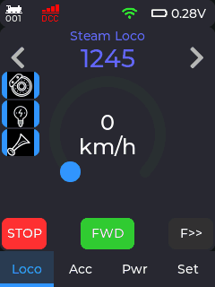

# DCC-EX-CYD port to CYD ESP32 hardware for use with DCC-EX 



### 🚂 Navigation & Tabs
The interface is split into four primary tabs anchored to the bottom of the screen:
- **Locomotive**: Drive your trains with a touch speedometer, toggle F0-F28 functions, and swap active locos quickly.
- **Accessories**: Fast-access control to toggle layout turnouts and accessories using their DCC address.
- **Power**: Control and monitor the DCC-EX Command Station track power (Main, Prog, Join).
- **Settings**: Configure WiFi connections, screen brightness, rotation, touch calibration, and more.

A powerful, touch-enabled WiFi throttle for DCC-EX Command Stations, built natively on **LVGL** for the ESP32 Cheap Yellow Display (CYD).

## Overview
DCC-EX-CYD port that transforms an ESP32-2432S028R into a handheld model railway controller. It communicates asynchronously via WiFi directly to a DCC-EX Command Station. 

The firmware uses **FreeRTOS** and **LVGL 9** to provide a robust and clean UI

## Hardware Requirements
- **ESP32-2432S028R** (Also known as the CYD / Cheap Yellow Display)
- **Screen**: 2.8" TFT (240x320) with ILI9341 Driver
- **Touch**: Resistive or Capacitive touch panel support
- **Power**: Internal battery circuitry (parsed natively for on-screen display)

## Software Stack
- **PlatformIO**: Primary build environment and C++ Framework
- **LVGL (v9.1)**: Modern embedded graphics library handling the UI, layouts, widgets, and multi-tab swiping physics.
- **FreeRTOS**: Handles async WiFi keep-alives, background voltage checks, and strictly manages LVGL thread safety via Mutex locks.
- **AsyncTCP**: Low-latency network stack for high-performance bidirectional DCC-EX communication.

---

## Core Architecture & Key Functions

The system is constructed around a single, persistent root layout. The core UI modules are loaded once into memory during boot, completely eliminating visual teardowns, loading flickers, and latency. 

### 1. System Initialization & Concurrency (`main.cpp`)
The entry point of the firmware. 
- Initializes the ESP32 hardware, the TFT/CYD drivers, and LVGL.
- Spawns asynchronous FreeRTOS background tasks (`keepWiFiAlive`, `powerCheck`).
- Intercepts incoming network streams from `AsyncTCP` and routes DCC-EX packets.
- **Thread Safety**: Governs a global `lvgl_mutex` Semaphore. All asynchronous network/hardware callbacks are strictly locked before mutating LVGL widget states, ensuring the UI loop never panics during concurrent touch inputs.

### 2. Global View Manager (`LVGL_Layouts.cpp / .h`)
Replaces the legacy view-swapper with a unified native LVGL container system.
- **Top Status Bar**: Displays real-time battery voltage, WiFi state, Command Station connection, and active locomotive count utilizing dynamic LVGL symbolic icons (`LV_SYMBOL_WIFI`, `LV_SYMBOL_BATTERY_FULL`, custom Loco and DCC connection icons).
- **Navigation**: Deploys an `lv_tabview` anchored to the bottom of the screen. It seamlessly hosts the 4 permanent sub-applications, enabling native physical swiping between them.

### 3. Loco Control (`LocoUI.cpp`)
The primary dashboard for driving locomotives.
- **Throttle**: Features an `lv_arc` serving as a dynamic rotary speedometer.
- **Function Mapping**: Parses `[address].json` files from LittleFS/SD to dynamically generate a dual-column scrolling list of `F0-F28` buttons specific to the active locomotive.
- **Selection Submenu**: Clicking the active address instantly spawns a hidden overlay popup menu, allowing you to seamlessly swap locomotives via keypad entry.
- **Direction / E-Stop**: Instant DCC directional toggles and emergency track halts.

### 4. Accessory / Turnout Manager (`AccessoriesUI.cpp`)
A fast-access manager for layout turnouts and switch machines. Tapping ON/OFF dynamically summons a numeric `lv_keyboard` mapped to an input area, letting you rapidly punch in DCC Accessory Addresses (1-2044) and broadcast their states to the track.

### 5. Track Power (`PowerUI.cpp`)
Binds natively to incoming `BROADCAST_POWER` events from the Command Station. Features tactile toggle switches to safely manipulate power across the Main Track, Programming Track, or electronically join them together.

### 6. Settings & Network Hub (`SettingsUI.cpp`)
- Controls hardware variables like screen brightness (hooked directly into the CYD backlight driver).
- **Nested Popups**: Contains heavy-duty sub-modules (`WiFiUI.cpp` and `AboutUI.cpp`) that dynamically popul over the settings UI. `WiFiUI` renders local AP configuration portals or QR codes, while `AboutUI` cleanly tracks live hardware specs and parses Command Station firmware hashes.

---

## Building and Compiling
The project is configured out-of-the-box via `platformio.ini`. 

1. Open the repository in **VSCode** with the **PlatformIO** extension installed.
2. Select the `esp32-2432S028R` environment.
3. Click **Build** and **Upload** to flash your CYD.
4. *Important*: Remember to also run **Upload File System Image** (LittleFS) to upload the necessary loco JSON definitions and system configurations to the ESP32 flash memory. Note: the file system image is flashed to the `website` partition, while the `config` partition is formatted automatically on first boot.

---

## SD Card & Touch Screen SPI Multiplexing

The ESP32 Cheap Yellow Display (CYD) features a notorious hardware conflict: **The SD Card reader and the Resistive Touch Screen are intended to share the same VSPI hardware controller, but are wired to completely different pins.**
- **Touch Pins**: `CLK=25`, `MISO=39`, `MOSI=32`, `CS=33`, `IRQ=36`
- **SD Card Pins**: `CLK=18`, `MISO=19`, `MOSI=23`, `CS=5`

Standard hardware SPI libraries (`SPI.begin()`) cannot easily multiplex between two radically different pin configurations on the fly without triggering core panics or severely degrading performance.

### The Bit-Bang Workaround
To resolve this, this project bypasses the default hardware touch drivers included in `LVGL_CYD`. Instead, the touch screen is driven via a custom **Software SPI (Bit-Bang)** implementation based on [TheNitek/XPT2046_Bitbang_Arduino_Library](https://github.com/TheNitek/XPT2046_Bitbang_Arduino_Library). 
1. **Touch Screen**: Handled entirely in software via standard `digitalRead`/`digitalWrite` pulses. This frees up the hardware VSPI bus completely.
2. **SD Card**: The SD Card reader is granted exclusive access to the hardware VSPI bus (`SD.begin(5, SPI...)`), allowing for high-speed file transfers, formatting, and directory parsing.
3. **Calibration**: Touch calibration coordinates are managed programmatically via the `Settings` menu and scaled dynamically, maintaining native LVGL rotation support.

---

## Custom Icons (LVGL 9)

Generating and importing custom icons into this project requires specific formatting to work properly with LVGL 9 and the C++ linker:

1. **Size Constraints**: Size your icon appropriately (status bar 21x21 pixels, elsewhere 30x30 pixels) *before* converting it. Do not rely on runtime `lv_image_set_scale` for small status bar icons, as it is computationally expensive and can lead to visual artifacts.
2. **Format Generation**: Use an image converter (like the [LVGL Online Image Converter](https://lvgl.github.io/lv_img_conv/)) or generate the C array directly. 
   - Use `LV_COLOR_FORMAT_ARGB8888` for full-color images with transparency.
   - Use `LV_COLOR_FORMAT_A8` (Alpha 8-bit) if you want to dynamically tint/recolor the image at runtime using `lv_obj_set_style_image_recolor()`. This format treats the array as a transparency mask rather than literal color data.
3. **Mandatory Header Fields (The Stride Trap)**: If you generate the array yourself or modify an older LVGL 8 structure, you **must** explicitly define `.header.stride` in the nested `lv_image_dsc_t` header (e.g. `stride = 120` for a 30-pixel wide ARGB8888 image, or `stride = 30` for A8). If you omit this, LVGL 9 defaults the stride to `0`, which silently renders the image with a width of 0 (invisible).
4. **Variable Naming (The Linker Trap)**: When the converter generates the `.c` file, it often uses a default variable name for the structure (like `download` or `image1`). You **must** rename this variable to match your intended usage in the C++ code (e.g., `const lv_image_dsc_t train_icon = {...}`). Failure to do so will result in an `undefined reference` linker error during compilation.
4. **Header Declaration**: In your `.h` file, declare the icon struct using `extern "C"` so the C++ linker can find the C-compiled array:
   ```cpp
   #ifdef __cplusplus
   extern "C" {
   #endif
   extern const lv_image_dsc_t train_icon;
   #ifdef __cplusplus
   }
   #endif
   ```
